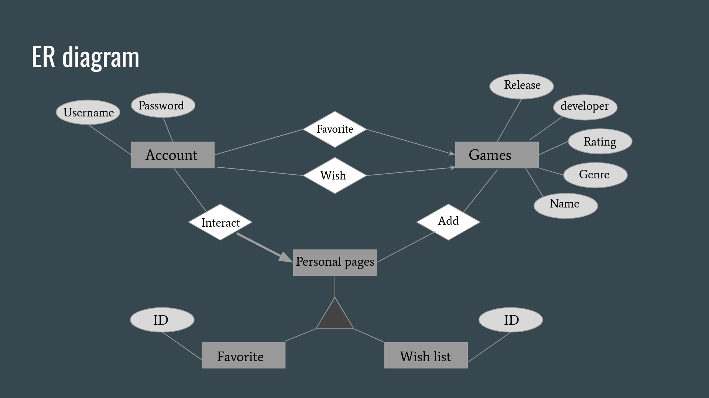

# Setting up the game database :

You need to have a functional Python 3 installation to use the site. 

1. First install all the dependencies using the code below
>$ pip install -r requirements.txt

2. Initialize the 5 necessary database, by running the SQL files
	  psql -d{database} -U{user} -f Favorites.SQL
	  psql -d{database} -U{user} -f WishList.SQL
	  psql -d{database} -U{user} -f Email.SQL
	  psql -d{database} -U{user} -f Create VideoGame.SQL
	  psql -d{database} -U{user} -f Create Users.SQL

Make sure to be in src folder, or change the path to the sql files in the src folder.

3. Go into the app.py file and set your own database, username and password

4. Then you can run Web-App by using the code below
>$ python src/app.py

----------------------------------------------------------------------------------------------

# How to use the application:

1. Create account
When you start the web-app you need to create an account, to do this you press the new account button and write a username and password

2. Change password (UPDATE SQL is used here)
If you want to change your password you can press change password. You will then have to put in your username, password and the new password 2 times. If the passwords doesn't match up, youll get an error message otherwise your password will be updated in the database

3. login
When logining in, use your password and username. If the password is wrong you cant log in and will get an error messeage at the top of the screen

4. Frontpage filters (SELECT)
Once you've logged in you can see our homepage where you can filter through the games. We have 4 filters for you to use. Titel, genre, userscore and release year. The genre, userscore and release year is dropdown menues and the titel allows you to write a word or name, thereby finding all games with the word in the titel. Once you've chosen your filters you can serach for all games that fall under the filters 

5. Faorites and Wishlist pages (DELETE and INSERT)
When you click on a game, you have the option to add or remove them from your wishlist and favorites pages.

6. Contact page (ER is used here)
Finally we have used ER to create a newsletter page where you put in an email. The mail must be an @alumni.ku.dk mail

